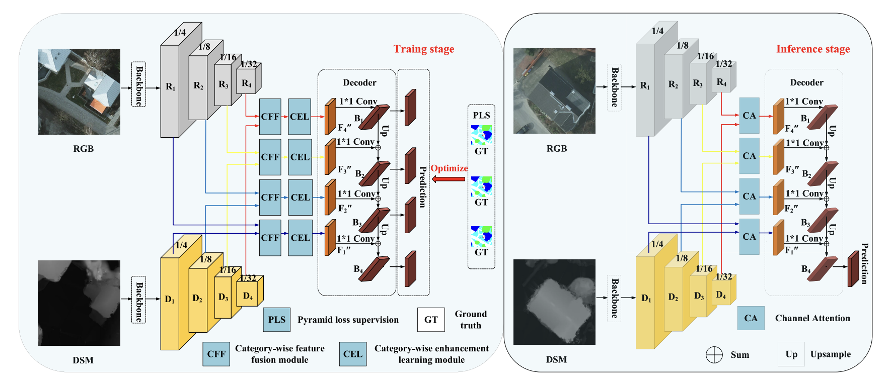

# 🔥🔥🔥 Category-Wise Fusion and Enhancement Learning for Multimodal Remote Sensing Image Semantic Segmentation
This repository is an official implementation of the paper [CaFE](https://aihuazheng.github.io/publications/pdf/2022/2022-Category-Wise_Fusion_and_Enhancement_Learning_for_Multimodal_Remote_Sensing_Image_Semantic_Segmentation.pdf).

## ☀️ Introduction


**Abstract.** This article presents a simple yet effective method called Category-wise Fusion and Enhancement learning (CaFE), which leverages the category priors to achieve effective feature fusion and imbalance learning, for multimodal remote sensing image semantic segmentation. In particular, we disentangle the feature fusion process via the categories to achieve the category-wise fusion based on the fact that the feature fusion in the same category regions tends to have similar characteristics. The disentangled fusion would also increase the fusion capacity with a small number of parameters while reducing the dependence on large-scale training data. For the sample imbalance problem, we design a simple yet effective category-wise enhancement learning scheme. In particular, we assign the weight for each category region based on the proportion of samples in this region over the whole image. By this way, the learning algorithm would focus more on the regions with smaller proportion. Note that both category-wise feature fusion and imbalance learning are only performed in the training stage, and the segmentation efficiency is thus not affected. Experimental results on two benchmark datasets demonstrate the effectiveness of our CaFE against other state-of-the-art methods.

### 🛠️ How to use this code: 
### ⚡️ Training: 
coming soon

### ✨ Testing:
coming soon

### 📑 Citing CaFE
If you find CaFE useful in your research, please consider citing:

```
@inproceedings{aihuazheng2022CaFE,
  title     = {Category-Wise Fusion and Enhancement Learning for Multimodal Remote Sensing Image Semantic Segmentation},
  author    = {Aihua Zheng, Jinbo He, Ming Wang, Chenglong Li, Bin Luo},
  journal   = {{IEEE} Trans. Geosci. Remote. Sens.},
  volume    = {60},
  pages     = {1--12},
  year      = {2022},
  url       = {https://doi.org/10.1109/TGRS.2022.3225843},
  doi       = {10.1109/TGRS.2022.3225843},
}
```